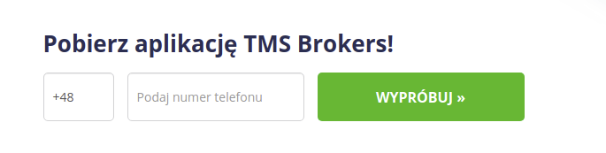

# Header

## Top navigation bar

    * [TMS Connect](https://www.tms.pl/doladuj-konto)  
    * [Zasil rachek](https://www.tms.pl/doladuj-konto) - Documentation link [here](zasil-rachunek.md) 
    * [Strefa Klient](https://strefa.tms.pl/) 
    * [TMS Nonstop](https://www.tms.pl/nonstop/aktualnosci) 
    * [Help center](https://pomoc.tms.pl/hc/pl)

## Open onboarding account
[Link to onboarding](https://pomoc.tms.pl/hc/pl)

## Demo account form popup
    * Popup Form - `go4x_demo` modules

    * `Type - MT4`
        - Required Fields
            * Name
            * Email
            * Phone
            *  Agreement - `regulation - https://www.tms.pl/document/337233`
    * `Data Layer`
        {
           "event": "lead",
           "userId": md5(email)",
           "ecommerce": {
              "purchase": {
                 "actionField": {
                    "id": leadId,
                    "revenue": "0.0",
                    "tax": "0.0",
                    "shipping": "0.0",
                    "action": "purchase"
                 },
                 "products": [
                    {
                       "name": "Demo - HP_Slider_Demo",
                       "id": leadId,
                       "price": "0.0",
                       "brand": "TMS.PL",
                       "category": "Demo",
                       "quantity": 1
                    }
                 ]
              }
           },
           "gtm.uniqueEventId": 20
        }

## Zendesk Search autocomplete
     * `tms_zendesk` modules

        - Url : `https://tmsbrokers.zendesk.com/api/v2/help_center/articles/search.json?query='. keyword`
        - User: `pk@tms.pl`
        - PP : `---`
    
# Frontpage

## Sms app link form
    * `tms_lead` module

Data Layer

        `{
            "event": "GAevent",
            "eventCategory": "Aplikacja",
            "eventAction": "Numer",
            "eventLabel": md5(number)
        {
  

## Live quotes
    * `go4x_block` modules
  
  

## News and events
    * View `promoted_content-block`

    
## Online and video training
    * View `courses-block_1`

# Footer